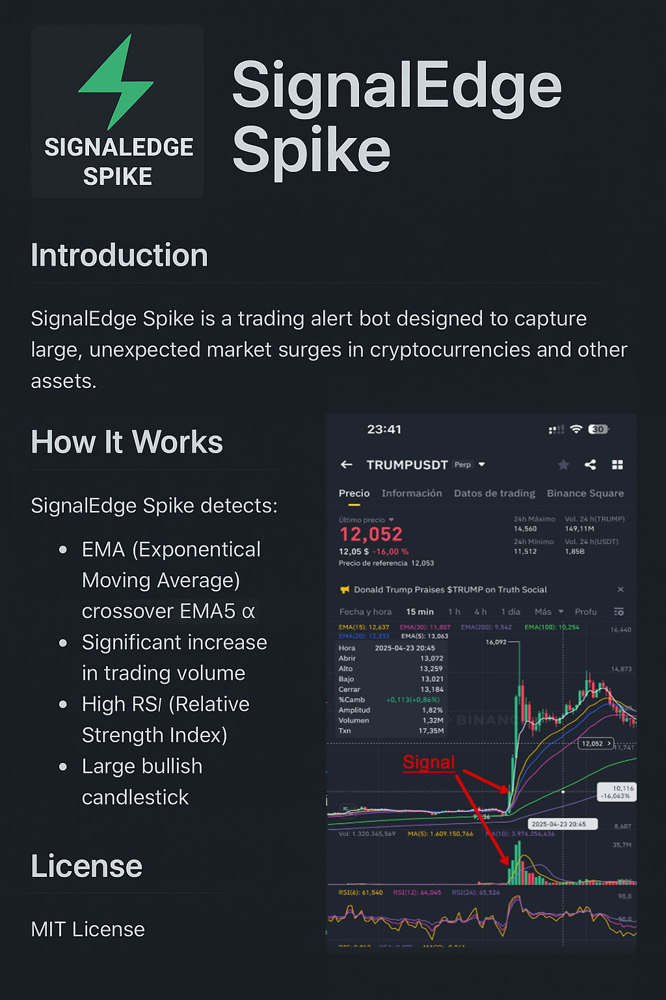
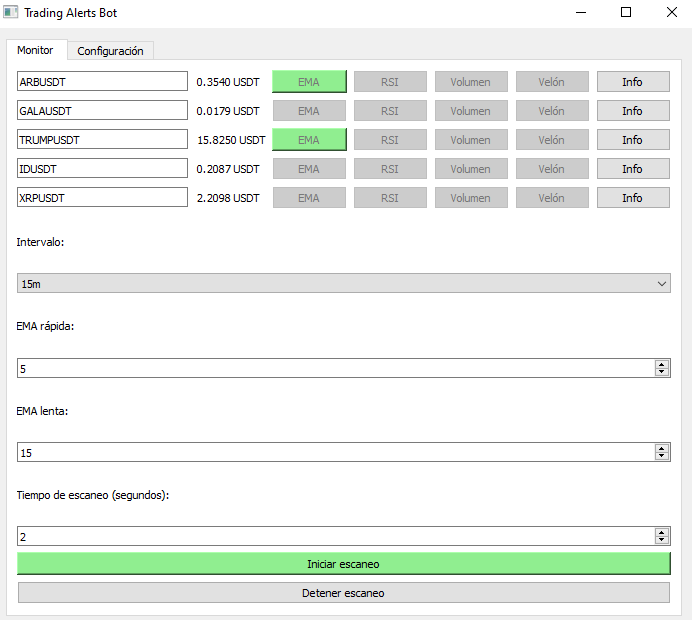
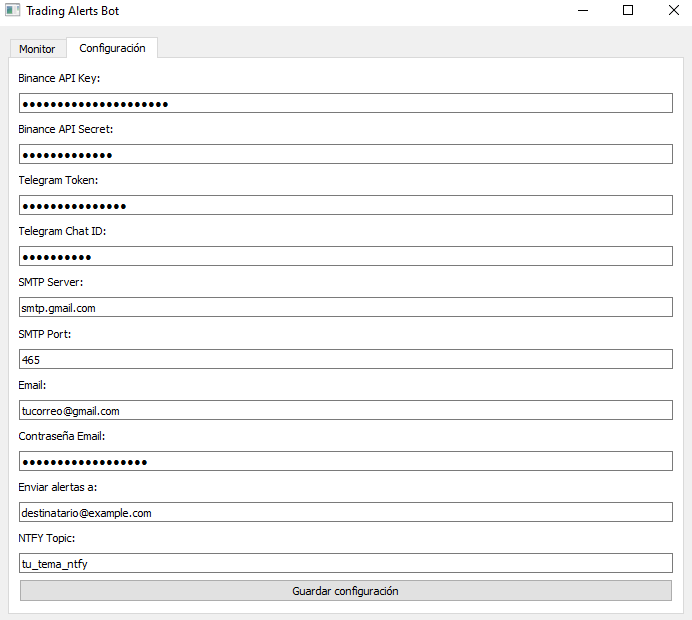

# SignalEdge Spike

SignalEdge Spike es un bot de alertas de trading en tiempo real diseñado para detectar movimientos bruscos e inesperados al alza en el mercado, especialmente en pares de criptomonedas como **TRUMPUSDT**. Esta herramienta ayuda a los traders a anticiparse a oportunidades explosivas mediante una estrategia técnica precisa basada en impulso y volumen.



---

## Características

- Detecta fuertes señales alcistas utilizando los siguientes criterios:
  - **Cruce EMA**: la EMA(5) cruza por encima de la EMA(15)
  - **RSI > 70**: indica fuerte presión compradora
  - **Volumen alto**: el volumen actual es mucho mayor al promedio
  - **Vela alcista grande**: vela con cuerpo importante y cierre fuerte
- Monitorea múltiples pares en **Binance Futures**
- Parámetros totalmente configurables (intervalo, EMAs, tiempo de escaneo)
- Interfaz gráfica con **PyQt5**
- Alertas mediante:
  - 📬 **Telegram**
  - 📧 **Correo electrónico**
  - 📲 **Notificaciones push** (NTFY)

---

## Cómo funciona

SignalEdge Spike analiza datos de velas en un intervalo configurable (ej. 15 minutos) para cada par seleccionado. Se genera una señal cuando se cumplen las siguientes condiciones:

- La EMA(5) cruza por encima de la EMA(15)
- El RSI(6) supera los 70 puntos
- El volumen de la vela actual es al menos 3 veces mayor que el promedio
- La vela tiene un cuerpo alcista grande

### Ejemplo:
Se genera una señal al cierre de la vela del **23 de abril de 2025 a las 23:00 UTC**, con un precio de **10,131 USDT** en el par **TRUMPUSDT**:

---

## Instalación

```bash
# Clonar el repositorio
git clone https://github.com/TradeAIcode/SignalEdge-Spike.git
cd SignalEdge-Spike

# Instalar dependencias
pip install -r requirements.txt

# Ejecutar el bot
python main.py
```

---

## Configuración

Puedes configurar el bot desde la interfaz gráfica o editando manualmente el archivo `config.json`. Algunos de los campos clave son:

```json
{
    "api_key": "tu_api_key_de_binance",
    "api_secret": "tu_api_secret",
    "telegram_token": "token_de_tu_bot",
    "telegram_chat_id": "tu_chat_id",
    "smtp_server": "smtp.gmail.com",
    "smtp_port": "465",
    "email": "tucorreo@gmail.com",
    "email_password": "tu_contraseña_app",
    "email_to": "destinatario@example.com",
    "pairs": [
        "ARBUSDT",
        "GALAUSDT",
        "TRUMPUSDT",
        "IDUSDT",
        "XRPUSDT"
    ],
    "interval": "15m",
    "ema_fast": 5,
    "ema_slow": 15,
    "scan_time": 2,
    "ntfy_topic": "tu_tema_ntfy"
}
```

Todos los valores también pueden editarse desde la interfaz.

---

## Interfaz gráfica (GUI)

La interfaz se divide en dos pestañas:

- **Monitor**: iniciar/detener escaneo, ver precios en tiempo real, observar activación de señales
- **Configuración**: credenciales de API, alertas, lista de pares y parámetros

Cada par tiene su propio campo editable junto con su precio actual.

### Vista de la pestaña "Monitor":

La GUI muestra una tabla con el siguiente formato:

| Par        | Precio     | EMA   | RSI   | Volumen | Velón | Info |
|------------|------------|-------|-------|---------|--------|------|
| TRUMPUSDT  | 13.0170 USDT | 🟢    | ⚪️    | ⚪️      | ⚪️     | 🔍 |

- Los indicadores aparecen en verde (🟢) si se cumplen las condiciones de la estrategia.
- El botón "Info" abre una ventana popup con los detalles exactos de la última vela:
  - Valores de EMA rápida y lenta
  - RSI
  - Volumen y su comparación con la media
  - Si la vela es considerada un "velón"



### Vista de la pestaña "Configuración":



---

## Canales de alerta

SignalEdge Spike soporta tres tipos de notificaciones:

- ✅ **Telegram**: mensajes directos desde tu bot
- ✅ **Correo electrónico**: mensajes SMTP a tu bandeja de entrada
- ✅ **Push (NTFY)**: notificaciones instantáneas en el móvil

### NTFY - Notificaciones Push

El bot es compatible con [NTFY](https://ntfy.sh), un sistema gratuito de notificaciones push que te permite recibir alertas instantáneas en tu teléfono (Android/iOS) o navegador. Solo necesitas configurar un *topic* (tema) personalizado en la aplicación o en el navegador, y el bot enviará ahí las alertas.

Ventajas:
- Sin registro
- Gratuito
- Compatible con móvil y escritorio
- No se requiere clave API

---

## Licencia

Licencia MIT. Consulta el archivo `LICENSE` para más detalles.

---

## Autor

Desarrollado por TradeAIcode ❤️  
Precisión. Velocidad. Oportunidad.

